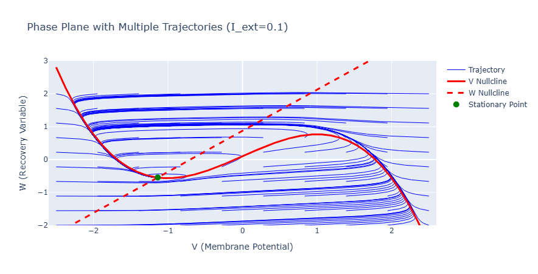
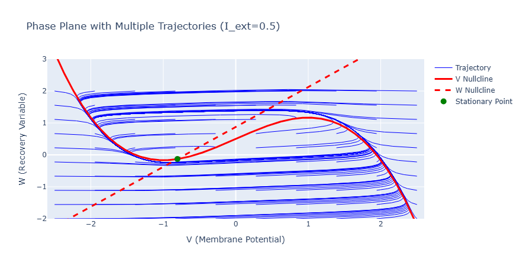
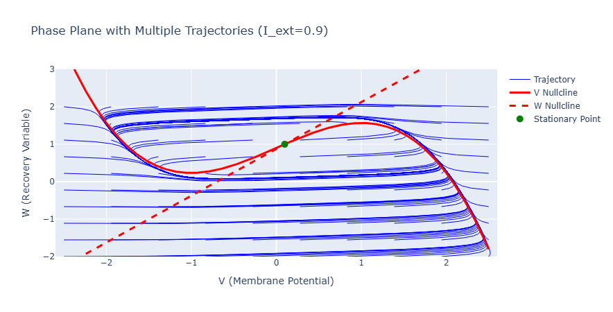
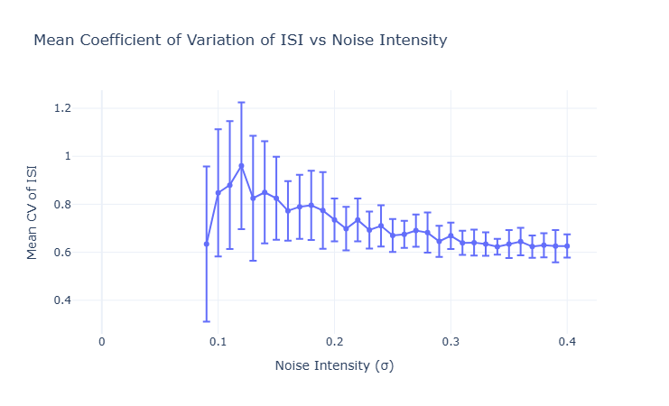
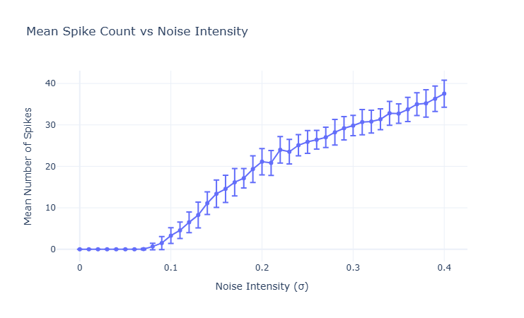
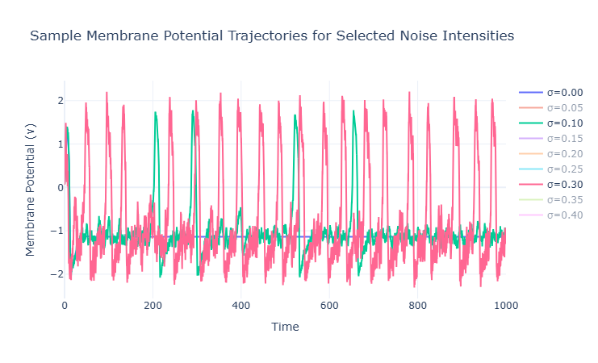

# An Introduction to the Stochastic FitzHugh-Nagumo Model

## From deterministic excitability to noise-induced spiking

- Project topic: temporal regularity of noise-induced spikes
- Core model: FitzHugh-Nagumo (FHN)
- Big question: can noise make spiking more regular?

---

# Roadmap

1. Why neurons spike
2. Why use the FitzHugh-Nagumo model
3. Deterministic FHN dynamics
4. Adding noise: the stochastic FHN model
5. New machinery from stochastic calculus
6. What the simulations suggest

---

# A little neurobiology

- Neurons communicate with brief voltage pulses called action potentials
- The membrane potential changes because ions move through channels in the cell membrane
- After a spike, recovery processes make it harder to spike again immediately
- So even a simple neuron model needs:
  - a fast voltage variable
  - a slower recovery variable

---

# Why not just use Hodgkin-Huxley?

- The Hodgkin-Huxley model is biophysically detailed and very successful
- But it uses several coupled nonlinear equations and many parameters
- That is great for realism, but harder for qualitative analysis
- The FitzHugh-Nagumo model keeps the main story:
  - threshold behavior
  - excursion/spike behavior
  - refractory recovery

---

# The deterministic FitzHugh-Nagumo model

$$
\dot v = v - \frac{v^3}{3} - w + I
$$

$$
\dot w = \varepsilon (v + a - bw)
$$

- $v$: membrane potential
- $w$: recovery variable
- $I$: applied current
- $\varepsilon$: slow-fast time scale parameter

---

# Why this model is useful

- It is two-dimensional, so phase-plane geometry becomes visible
- Nullclines, equilibria, and limit cycles can be studied directly
- It shows several regimes depending on the input current $I$
- That makes it a good bridge between biology and dynamical systems

---

# Deterministic phase-plane ideas

The nullclines are

$$
w = v - \frac{v^3}{3} + I, \qquad w = \frac{v+a}{b}
$$

- Their intersections give equilibria
- The cubic nullcline creates threshold-like behavior
- The slow recovery variable pulls trajectories back after a spike
- Local stability comes from the Jacobian near equilibrium

---

# Deterministic regimes

- Small $I$: stable resting state
- Intermediate $I$: excitable regime
- Larger $I$: sustained oscillations / limit cycle spiking

Key idea:

In the excitable regime, the system sits near rest, but a large enough perturbation can trigger a full spike.

---

# Deterministic picture from this project

For low input current, trajectories return to a stable equilibrium.

---

# Deterministic picture from this project

At intermediate current, the system becomes much more sensitive to perturbation.

---

# Deterministic picture from this project

For larger current, trajectories are driven toward repetitive spiking behavior.

---

# Why add noise?

- Real neurons are not perfectly deterministic
- Ion-channel fluctuations, synaptic bombardment, and thermal effects introduce randomness
- In an excitable system, random kicks can push the state across threshold
- So noise can create spikes even when the deterministic system would stay near rest

---

# The stochastic FitzHugh-Nagumo model

$$
d v = \left(v - \frac{v^3}{3} - w + I\right)dt + \sigma \, dW_t
$$

$$
d w = \varepsilon (v + a - bw) \, dt
$$

- $W_t$: Brownian motion / Wiener process
- $\sigma$: noise intensity
- Setting $\sigma = 0$ recovers the deterministic model

---

# What is Brownian motion?

For our purposes, $W_t$ is a random process with:

- $W_0 = 0$
- independent increments
- Gaussian increments: $W_{t+h} - W_t \sim N(0,h)$
- continuous but nowhere differentiable sample paths

Important consequence:

$$
\Delta W \sim \sqrt{\Delta t} Z, \qquad Z \sim N(0,1)
$$

---

# Why stochastic calculus is new here

In a standard nonlinear dynamics course, we usually use:

- ODEs
- phase portraits
- linearization
- bifurcations

For SDEs we need new ideas:

- stochastic integrals
- Brownian scaling
- Ito's Lemma
- numerical methods like Euler-Maruyama

---

# Why ordinary calculus breaks

For a smooth path $x(t)$, we keep only first-order terms in $dt$.

For Brownian motion, increments are much rougher:

$$
(dW_t)^2 \text{ behaves like } dt
$$

So second-order terms involving noise do not vanish.

That is the source of Ito corrections.

---

# Ito's Lemma: statement

Suppose

$$
dX_t = \mu(X_t,t)dt + \sigma(X_t,t)dW_t
$$

and $f(x,t)$ is smooth. Then

$$
df(X_t,t) = \left(f_t + \mu f_x + \frac{1}{2}\sigma^2 f_{xx}\right)dt + \sigma f_x \, dW_t
$$

Compared to the chain rule, there is an extra term:

$$
\frac{1}{2}\sigma^2 f_{xx} dt
$$

---

# Ito's Lemma: where the extra term comes from

Start with a second-order Taylor expansion:

$$
df \approx f_t dt + f_x dX_t + \frac{1}{2} f_{xx}(dX_t)^2
$$

Now insert

$$
dX_t = \mu dt + \sigma dW_t
$$

Then

$$
(dX_t)^2 = \mu^2(dt)^2 + 2\mu\sigma \, dt \, dW_t + \sigma^2 (dW_t)^2
$$

Use the Ito rules:

$$
(dt)^2 = 0, \qquad dt \, dW_t = 0, \qquad (dW_t)^2 = dt
$$

So only $\sigma^2 dt$ survives.

---

# Why Ito's Lemma matters here

- It replaces the chain rule for stochastic systems
- It is the basis for analyzing transformed stochastic processes
- It explains why noisy dynamics are not just ODEs with a random forcing term
- It is one of the first genuinely new technical tools beyond deterministic dynamical systems

---

# Numerical method: Euler-Maruyama

For small time step $\Delta t$,

$$
v_{n+1} = v_n + \left(v_n - \frac{v_n^3}{3} - w_n + I\right)\Delta t + \sigma \sqrt{\Delta t} Z_n
$$

$$
w_{n+1} = w_n + \varepsilon(v_n + a - bw_n)\Delta t
$$

with $Z_n \sim N(0,1)$.

- This is the stochastic analogue of forward Euler
- The $\sqrt{\Delta t}$ factor comes from Brownian scaling

---

# What quantity are we trying to optimize?

We measure spike-time regularity using the coefficient of variation of inter-spike intervals:

$$
CV = \frac{\sigma_{ISI}}{\mu_{ISI}}
$$

- Small CV = more regular spike timing
- Large CV = more irregular spike timing
- If an intermediate noise level minimizes CV, that suggests coherence resonance

---

# Coherence resonance

- Too little noise: spikes are rare and irregular
- Too much noise: the system is pushed around too strongly and timing becomes irregular again
- Intermediate noise: threshold crossings can become surprisingly regular

So noise is not always destructive; sometimes it organizes the dynamics.

---

# Simulation result: CV versus noise

- The curve suggests a dip at intermediate noise intensity
- That is the signature we expect for coherence resonance

---

# Simulation result: spike count versus noise

- As noise intensity grows, spike counts increase
- More noise makes threshold crossings easier
- But more spikes does not automatically mean more regular spikes

---

# Simulation result: sample trajectories

- Low noise: small fluctuations near rest
- Moderate noise: occasional and more structured spikes
- High noise: frequent but more strongly perturbed activity

---

# Deterministic vs stochastic viewpoint

Deterministic model:

- asks about equilibria, limit cycles, and basins

Stochastic model:

- asks about distributions, random trajectories, spike statistics, and mean behavior across trials

Same system, but a different language of analysis.

---

# Main takeaways

- FHN is a reduced neuron model with clear geometric structure
- The deterministic system explains excitability and repetitive spiking
- Noise can induce spikes even in a resting deterministic regime
- Stochastic calculus is needed because Brownian motion is too rough for ordinary calculus
- Ito's Lemma and Euler-Maruyama are the main new tools at this level
- The project data is consistent with coherence resonance

---

# Possible concluding question

How does randomness interact with nonlinear threshold dynamics so that an intermediate amount of noise can make a neuron fire more regularly rather than less regularly?

---

# Thank you

Possible next directions:

- compare Ito and Stratonovich interpretations
- discuss first-passage times and spike thresholds
- connect to coherence resonance in other excitable systems
